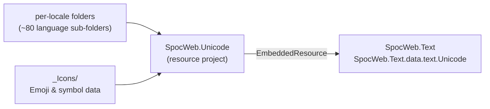

# SpocWeb.Unicode

<!-- digest-map
local-classes:
folders:
folder_digest: e3b0c44298fc1c149afbf4c8996fb92427ae41e4649b934ca495991b7852b855
folder_mtime: 2026-05-19T00:00:00Z
-->

Resource project providing Unicode character data and emoji
tables as embedded resources for use by SpocWeb.Text
and other projects.

This project contains no compiled source code — it packages
Unicode character name databases, emoji sequences, and
related data files as embedded resources referenced by
`SpocWeb.Text.data.text.Unicode`.

## Architecture

